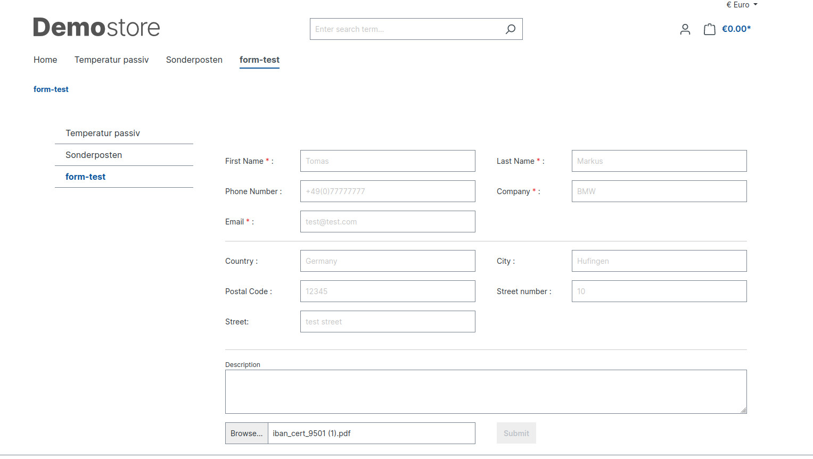
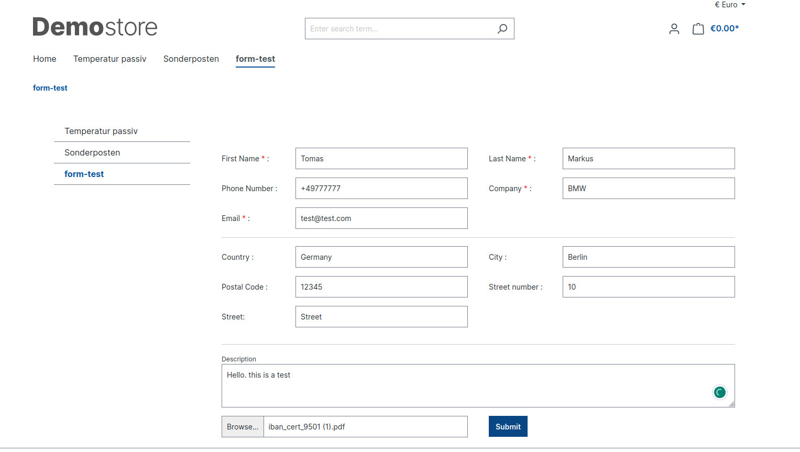
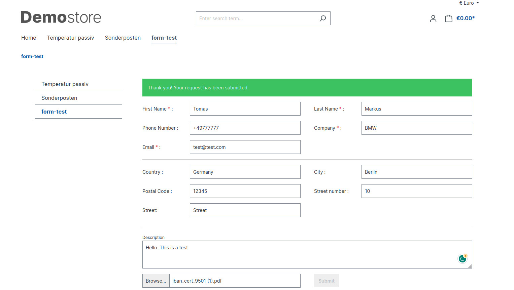
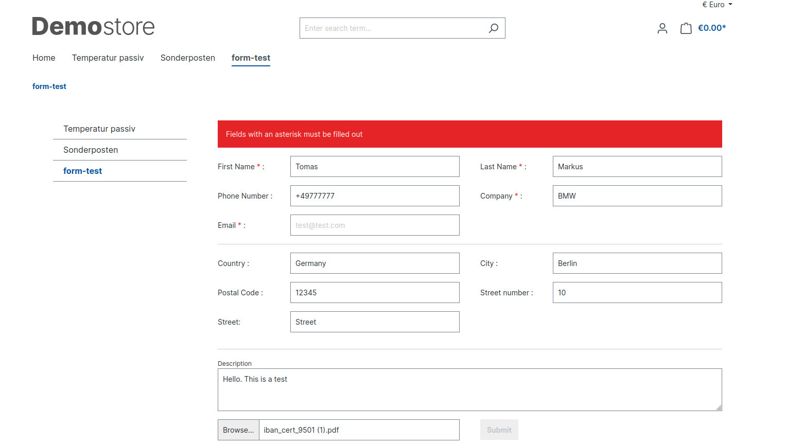
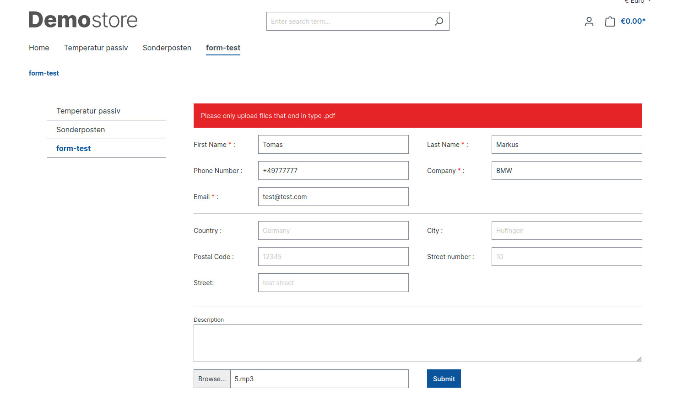
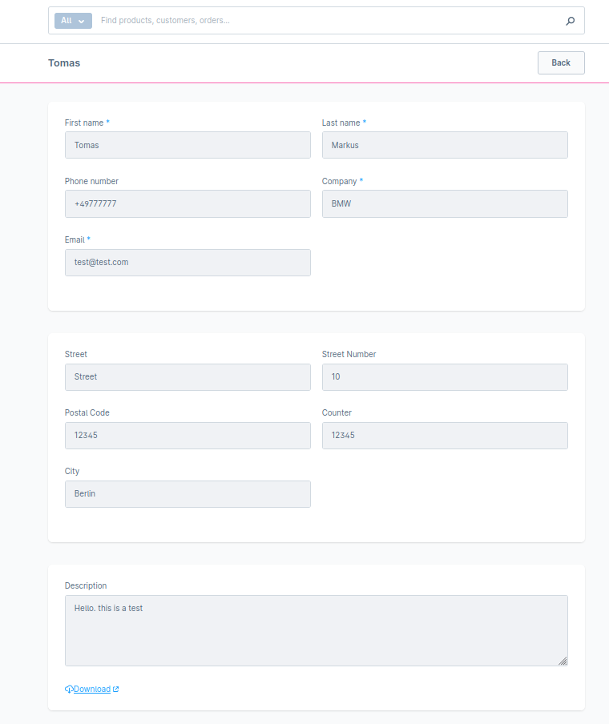
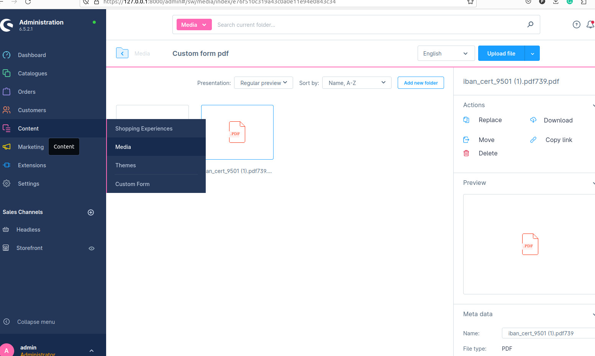

# Shopware 6.5 Plugin form with pdf file upload

With this plugin, you have a form the user can upload a pdf file after that data saves in the shop database instead of sending it via mail..

##Storefront

##Ajax Request (success message) 

##Ajax Request (error message) 

##Ajax Request (error message)

##Admin panel list

##Admin panel details form

After submitting if a user uploads a pdf file .this file is stored in the Custom form pdf folder. you can access all files from the media

